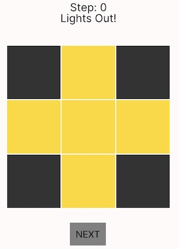
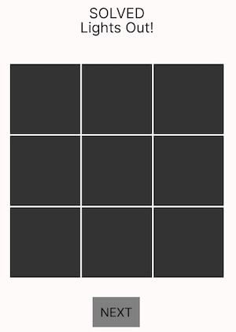
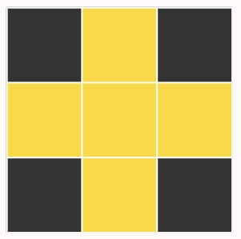
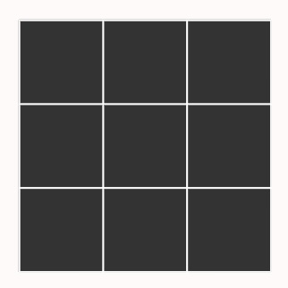
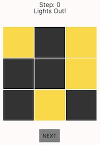
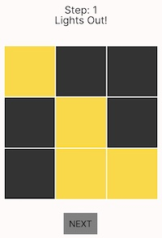
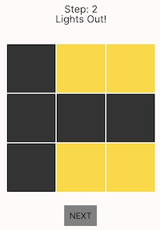
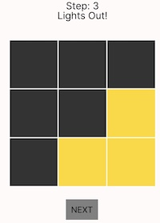
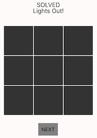

# Lights Out Puzzle

 


## Project Objective

The goal of this project is to model **Lights Out**, a grid-based puzzle, in Forge. In this game, a 3 x 3 grid of lights can be toggled on or off. Toggling a light changes not only its state but also that of its immediate neighbors. In order to win, you need to reach a board configuration where all lights are off. We have created a model that specifies the structure and rules of the puzzle as well as a custom visualization that allows users to step through sequences of moves (game traces) leading to a solved state. 

## Signatures

- **`Boolean`**: An abstract signature with two one sigs, `True `and `False`, representing the two possible states.

- **`Light`**: Represents a single cell in the grid. Each `Light` has a `on` field (a partial function from `Board -> Boolean`) that indicates whether the light is on for a particular board state. It also has neighbor fields (`up`,`down`, `left`, and `right`) that establish the grid’s structure:
    ```
    sig Light {
        on: pfunc Board -> Boolean,
        up: lone Light,
        down: lone Light, 
        right: lone Light,
        left: lone Light
    }
    ```

- **`Board`**: Represents a complete state of the puzzle. The `position` field maps a pair of integers (`row` and `column`) to a `Light`, and the `next` field links to the subsequent board state, forming a chain that captures the progression of moves.
    ```
    sig Board {
    position: pfunc Int -> Int -> Light,
    next: lone Board
    }
    ```

## Predicates

- **`within_bounds[row, col: Int]`**: this is a helper predicate defined to check whether a given `row` and `col` are within the 3 x 3 board positions.

- **`validneighbors[l: Light, b: Board]`**: checks whether a given `Light` has the correct neighbors defined in its `up`, `down`, `right` and `left` fields according to the `Board` state. 

- **`init[b: Board]`**: Initializes a board with a random configuration of lights (ensuring at least one light is on so that we don't start at a solved state).

- **`wellformed[b: Board]`**: Ensures that every grid cell in a board is populated with a Light and that all neighbor relationships adhere to the grid structure.

- **`solved[b: Board]`**: Specifies that a board is solved if all Lights are off.

- **`toggle[pre, row, col, post]`**: Models the effect of toggling a cell (and its immediate neighbors), transitioning the board from state `pre` to `post`.

- **`gameTrace`**: models a valid sequence of board states from an initial configuration to a solved state. It ensures that each transition results from a legal toggle move, the sequence has no cycles, and the final board is correctly solved.

## Model Design and Visualization

The model is designed to represent the puzzle as a *sequence* of board states, where each board consists of a 3x3 grid of lights that can be toggled on or off. The key design choice was to enforce valid game transitions using the toggle predicate, ensuring that each board state follows logically from the previous one.

In the Sterling visualizer, an instance should show a sequence of board states connected by the `next` relation, representing the progression of the game. Each board's light configuration can be interpreted as a step in solving the puzzle. Instead of using the default visualization, we created a custom visualization, allowing interactive step-by-step progression through the board states using a button, highlighting the active lights and indicating whether the puzzle was successfully solved.

As we were defining the predicates above, we would iteratively check their functionality by running the board configuration constrained by the predicate. 

**Initial Board**: run `startingBoard` to check for a valid starting board state. Here is an example of an initial Board state 



**Solved Board:** run `solvedBoard` to check for a the correct solved board state. Here is the result in the visualizer, showing all lights off. 



**Correct Toggl:e** run `twoBoards` to check if toggle works as expected before moving to longer game traces. Here we enforce that the the second board state must be `solved` and the first board state must be initialized correctly, only transitioning from one state to the next using `toggle`. Using the `next` button in the visualizer you can see the change between the 2 board states. 

 

**Longer Game Traces:**
To verify correctness, we included the `gameTrace` predicate to generate valid game sequences, alongside checks to confirm properties like board *well-formedness* and *solvability*. 

We used `traceBoards` and `traceBoardslarge` to generate instances that illustrate valid sequences of moves leading to a solved board. (varying from a sequence of 5 states to 10 to reach a solved board). Here is a 5 state sequence to solved as an example:

    


## Testing

### **Test Cases**

We wrote test `examples` and `assert` testing for property based testing. We had a test suite for all non-trivial predicates we wrote. 

- **`validneighbors`**: 
    -  `goodNeighbors`: is a positive case with correct neighbor assignments. 
    - `badNeighbors`: is a negative case with an incorrect neighbor assigned to a light. 

- **`wellformed`**: 
    -  `validWellformedBoard`: is a positive case with a complete well-formed board.
    - `invalidWellformedBoard`: is a negative case with an incorrect neighbor assigned to a light, which should also fail wellformed. 
    - `invalidWellformedBoard2`: has a light missing from the board. (negative)
    - `invalidpositionforwellformed`: has a light in 2 positions on the board (negative)

- **`solved`**: 
    -  `winningboard`: is a positive case with all lights off on the board.
    - `anotherwinningboard`: is a positive case with 2 boards, one winning and one not.
    - `losingboard` : is a negative case where no board is solved.

- **`init`**: 
    -  `validInit`: is a positive case with at least one light on in the board.
    - `invalidInit`: is a negative case with all lights off.

- **`toggle`**: 
    -  `validToggleCenter`: is a positive case with 2 board states, one pre and one post, with a center light being toggled correctly.
    - `validToggleSide`: is a positive case with 2 board states, one pre and one post, with a light on the side being toggled correctly.

## Documentation
- Code is commented to explain each predicate, transition, and constraint.
- Tests verify model behavior.
