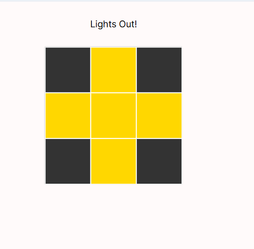
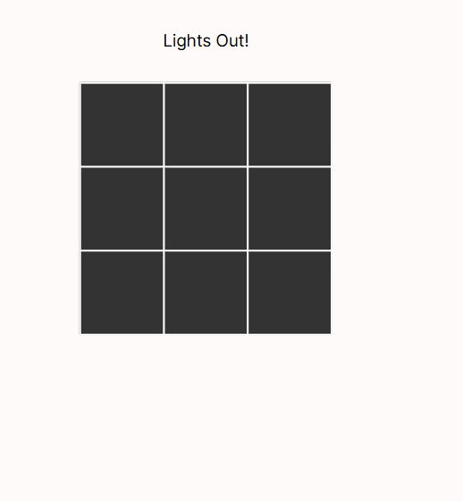

# Lights Out Puzzle

## Project Objective
The goal is to model the Lights Out puzzle, a grid-based game where pressing a cell toggles its state and adjacent cells. The challenge is to find a sequence of presses that turns all lights off starting from an initial configuration (all lights on).

## Model Design and Visualization
- **Grid Structure**: A 3x3 grid modeled using ordered rows and columns.
- **Adjacency**: Cells are adjacent if they share a row or column and are next to each other.
- **State Transitions**: Pressing a cell toggles its state and its neighbors'.
- **Visualization**: Uses default Forge visualization showing cell states and adjacency relations.

### Initial and Solved Conditions
Below are visual representations of the puzzle's initial state (lights on) and the solved state (all lights off).

#### Initial State (Some Lights On)

#### Solved State (All Lights Off)

## Signatures and Predicates

### **Signatures**
- `Row, Col`: Ordered sigs for grid positions.
- `Cell`: Represents a cell with:
  - `row`, `col`: Position identifiers.
  - `adj`: Adjacent cells (determined by row/column proximity).
  - `state`: Boolean indicating whether the light is on (`true`) or off (`false`).

### **Predicates and Functions**
- **`init`**: Initializes the grid with all cells turned on.
- **`adjacency`**: Defines which cells are adjacent based on their row and column indices.
- **`press[cell]`**: Defines the state transition when a specific cell is pressed, toggling its own state and that of its neighbors.
- **`solve`**: Finds a sequence of presses leading to all cells being turned off.

## Testing

### **Test Cases**

1. **`pressingCellTogglesCorrectly`**
   - **Description**: This test case ensures that pressing a cell toggles its state correctly, as well as the state of its adjacent cells (up, down, left, right).
   - **Purpose**: Validates that the pressing functionality works as expected, both for the target cell and its neighbors.
   - **Test Logic**: Press a specific cell (e.g., the center cell) and check if its state and the state of adjacent cells are toggled correctly.
  
2. **`solutionExists`**
   - **Description**: Verifies that a solution exists to turn all lights off, starting from the initial configuration where all lights are on.
   - **Purpose**: Ensures that there is a valid sequence of presses to reach the desired goal state.
   - **Test Logic**: Given the initial state, check if the `solve` function can find a sequence of presses that leads to the solved state (all lights off).
  
3. **`toggleEdgeCase`**
   - **Description**: Tests the behavior when pressing a corner or edge cell, ensuring that only the valid adjacent cells are toggled.
   - **Purpose**: Ensures that pressing edge/corner cells correctly handles fewer adjacent cells.
   - **Test Logic**: Press a corner cell and verify that only the expected adjacent cells (if any) are toggled.
  
4. **`noRedundantPresses`**
   - **Description**: Verifies that the solution found is optimal, meaning that no unnecessary presses are made.
   - **Purpose**: Ensures the model avoids redundant moves and reaches the solution in the minimum number of presses.
   - **Test Logic**: After a sequence of presses is found, verify that the minimal number of presses was used to solve the puzzle.

5. **`adjacencyCorrectness`**
   - **Description**: Ensures that the adjacency relations between cells are set up correctly, meaning each cell correctly identifies its neighbors.
   - **Purpose**: Verifies that each cell’s `adj` list (representing adjacent cells) includes only the valid neighbors.
   - **Test Logic**: For each cell, check if its adjacency list contains only its valid neighbors (up, down, left, right).

6. **`initStateVerification`**
   - **Description**: Ensures that the initial state of the puzzle has all lights turned on.
   - **Purpose**: Validates that the grid starts with the correct configuration before any presses are made.
   - **Test Logic**: Verify that each cell is in the "on" state (`true`) when the game begins.

7. **`pressingMultipleCells`**
   - **Description**: Verifies that pressing multiple cells in sequence toggles the correct states for all affected cells.
   - **Purpose**: Ensures that multiple presses on different cells correctly update the grid states.
   - **Test Logic**: Press multiple cells and verify that the resulting state reflects all toggles correctly.

8. **`solveAfterMultiplePresses`**
   - **Description**: Verifies that the puzzle can still be solved after multiple presses have been made (not necessarily in an optimal order).
   - **Purpose**: Ensures that the solver can find a valid solution even if the sequence of presses is not optimal.
   - **Test Logic**: After performing several presses, run the `solve` function and check if the puzzle can still be solved to the all-off state.

## Documentation
- Code is commented to explain each function, transition, and constraint.
- Tests validate model behavior and solution existence.
